[TOC]

# 基础逻辑电路

## 一.原力觉醒

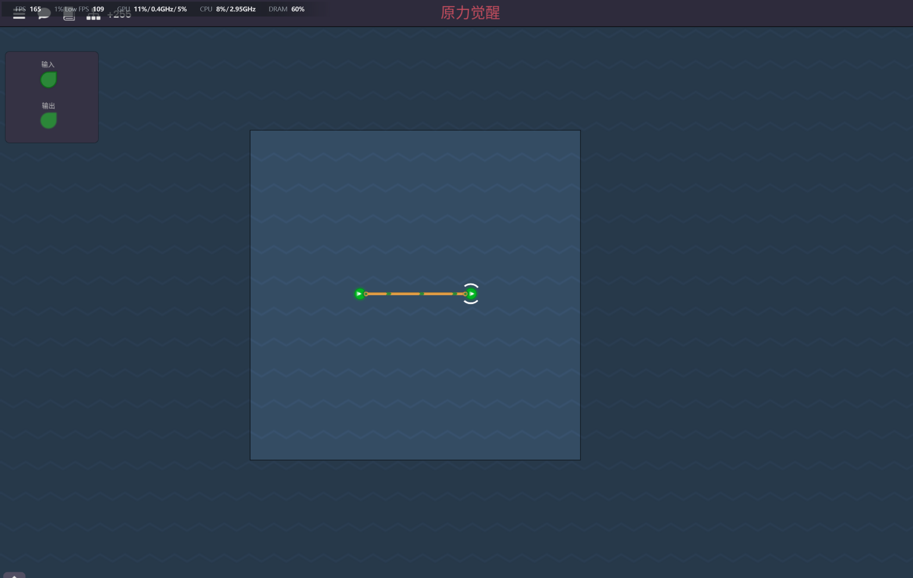

*入门了解输入输出模式*

## 二.与非门

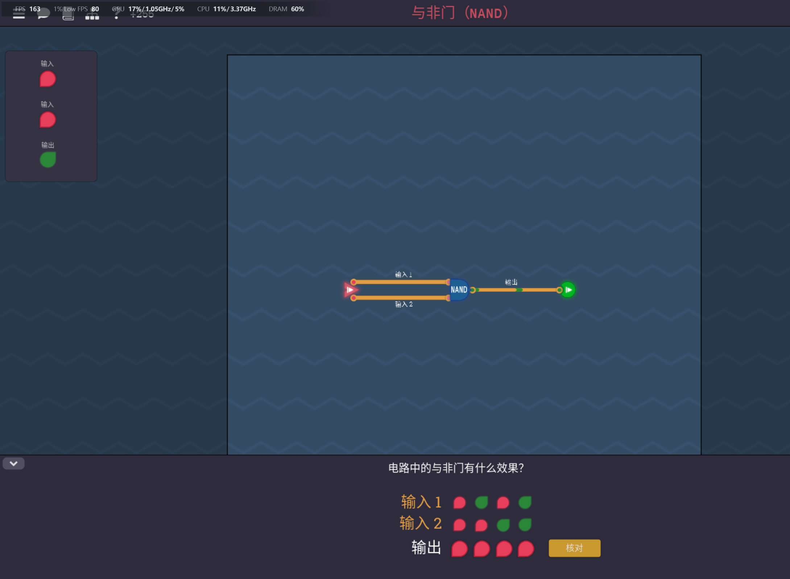

| 输入1 | 输入2 | 输出 |
| ----- | ----- | ---- |
| 0     | 0     | 1    |
| 0     | 1     | 1    |
| 1     | 0     | 1    |
| 1     | 1     | 0    |

## 三.非门

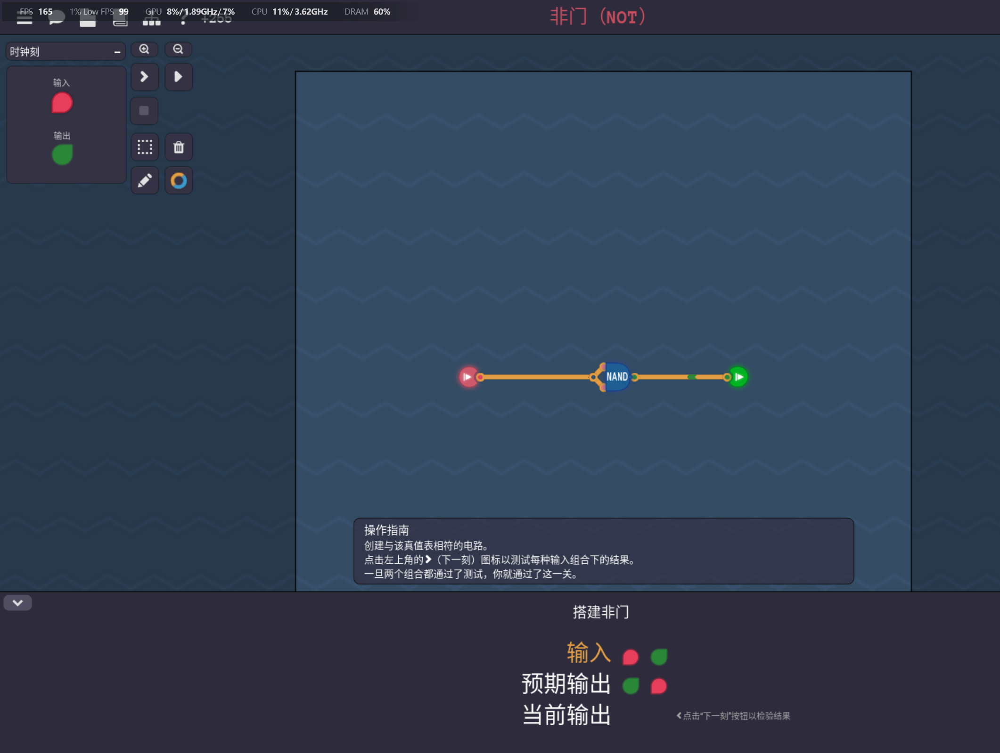

**1|x=1**
**0&x=0 **

## 四.与门

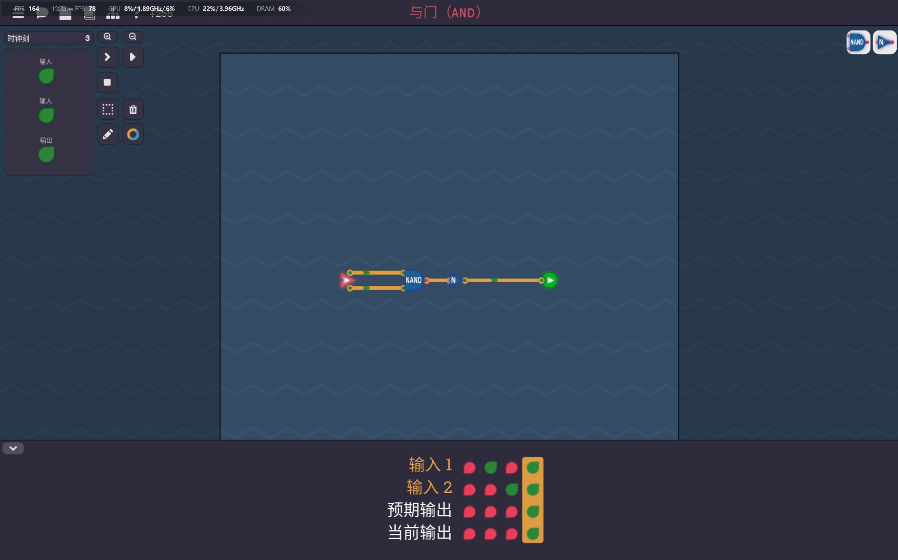

| 输入1 | 输入2 | 输出 |
| ----- | ----- | ---- |
| 0     | 0     | 0    |
| 0     | 1     | 0    |
| 1     | 0     | 0    |
| 1     | 1     | 1    |

## 五.或非门

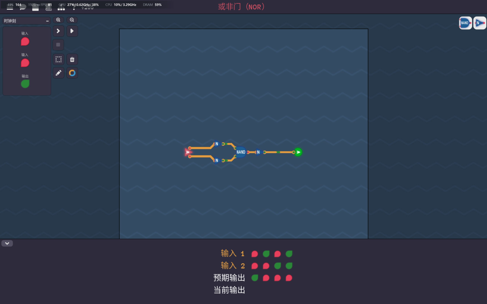

| 输入1 | 输入2 | 输出 |
| ----- | ----- | ---- |
| 0     | 0     | 1    |
| 0     | 1     | 0    |
| 1     | 0     | 0    |
| 1     | 1     | 0    |

## 六.或门

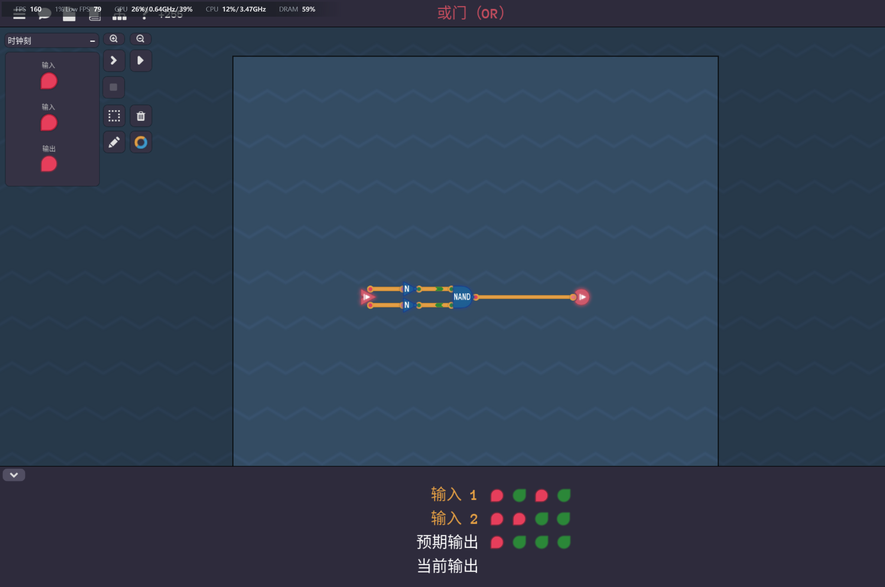

| 输入1 | 输入2 | 输出 |
| ----- | ----- | ---- |
| 0     | 0     | 0    |
| 0     | 1     | 1    |
| 1     | 0     | 1    |
| 1     | 1     | 1    |

## 七.高电平

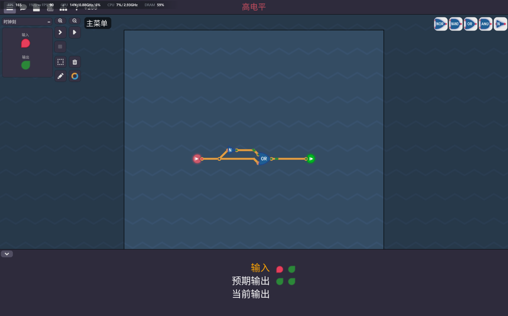

**优先用或门，有1取1**

## 八.第二刻

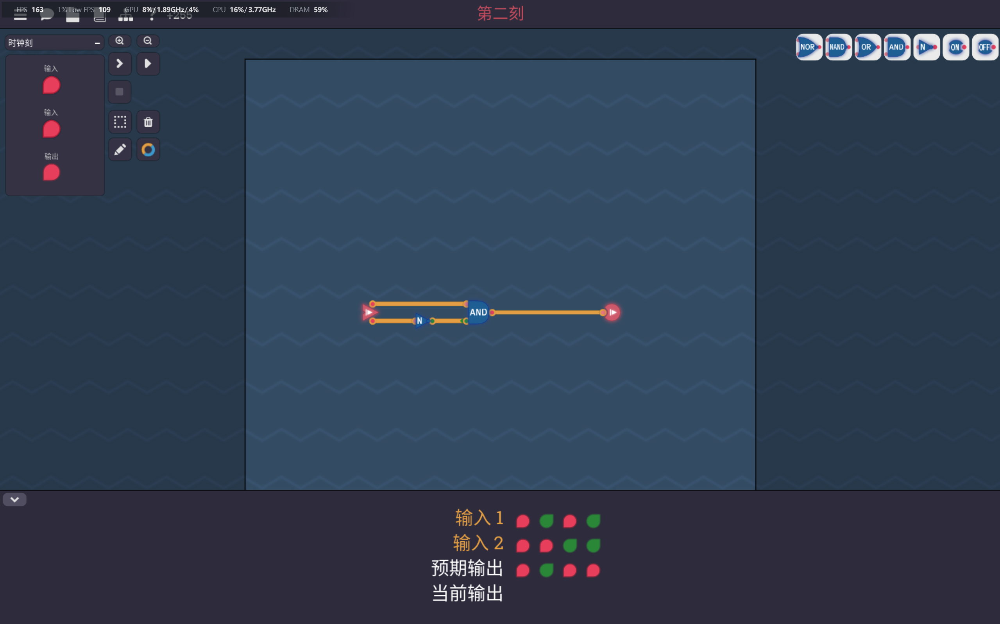

## 九.异或门

**同则取0，异则取1**

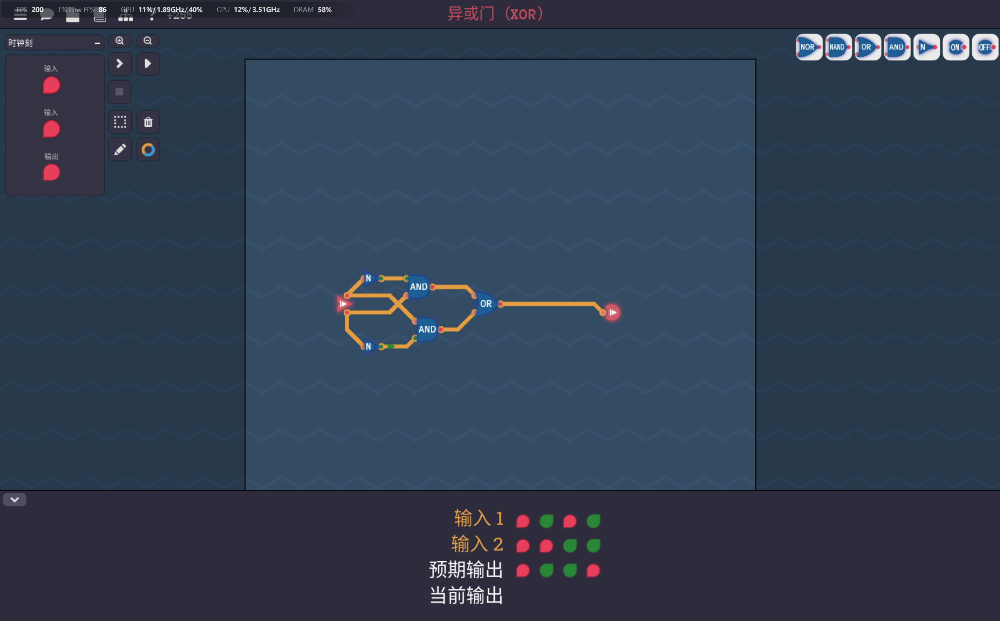

| 输入1 | 输入2 | 输出 |
| ----- | ----- | ---- |
| 0     | 0     | 0    |
| 0     | 1     | 1    |
| 1     | 0     | 1    |
| 1     | 1     | 0    |

等价于。

**由观察真值表化简卡诺图得到的**

## 十.三路或门

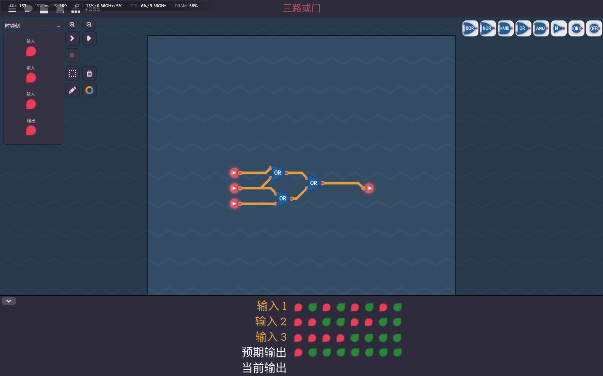

**与或门同样的逻辑，只是输入信号由两个变成了三个**

## 十一.三路与门

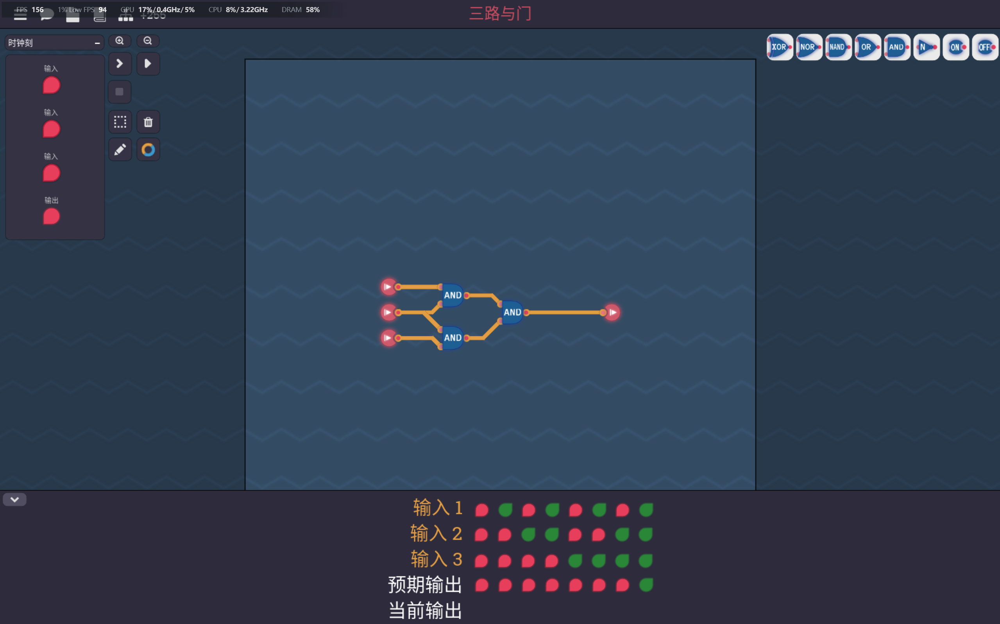

*与三路或门同理*

## 十二.同或门

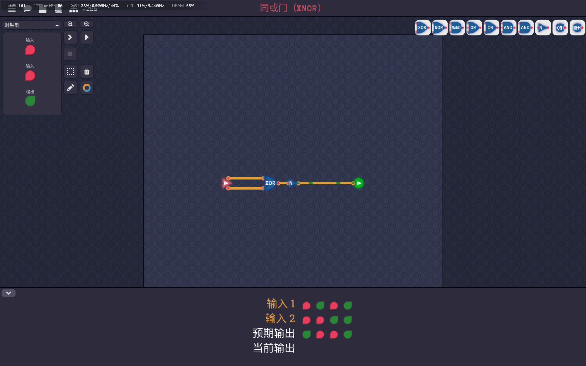

| 输入1 | 输入2 | 输出 |
| ----- | ----- | ---- |
| 0     | 0     | 1    |
| 0     | 1     | 0    |
| 1     | 0     | 0    |
| 1     | 1     | 1    |

**同则取1，异则取0**

**与异或门逻辑相反**，**所以在异或门的基础上取反就好**

## 十三.德摩根定律

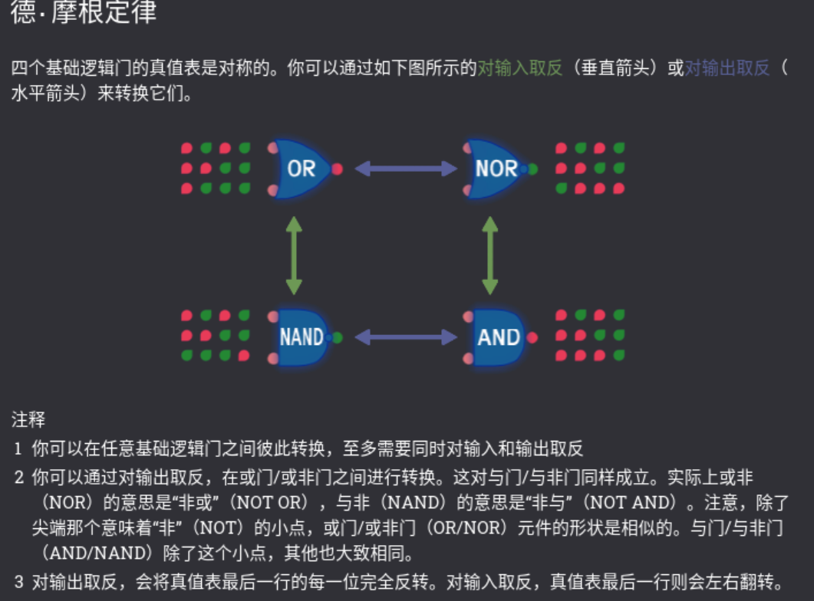

