[TOC]

## 算术运算和存储器

### 二进制速算

------

#### 关卡要求：能够达到三级速算

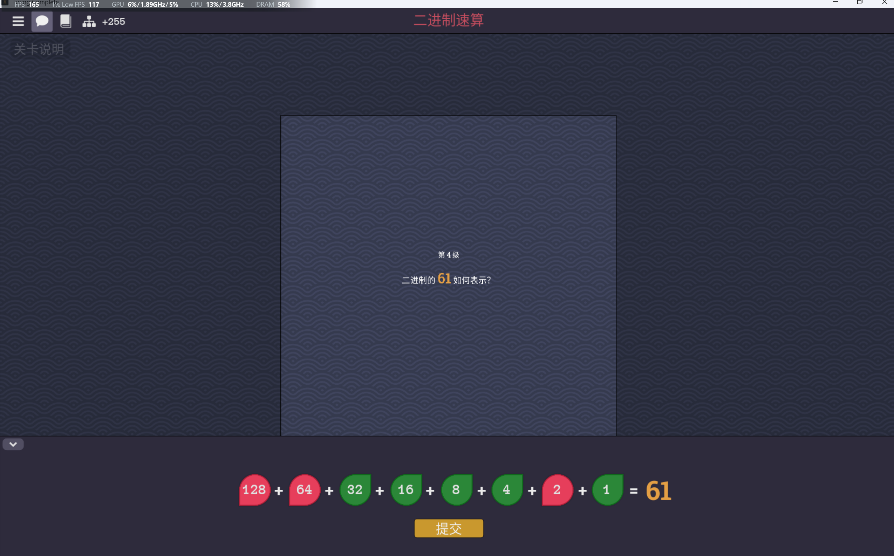

**由于计算机是二进制，所以需要对二进制数字很敏感，这里的速算是为了后面的关卡打基础。**

**需要做到能够快速反应出2^n^ 的值，这里只需到达到三级的速度就可以通关了**

### 成对的麻烦

---

#### 关卡要求：实现当有两个及以上的高电平的时候，输出高电平。剩余情况实现输出低电平。

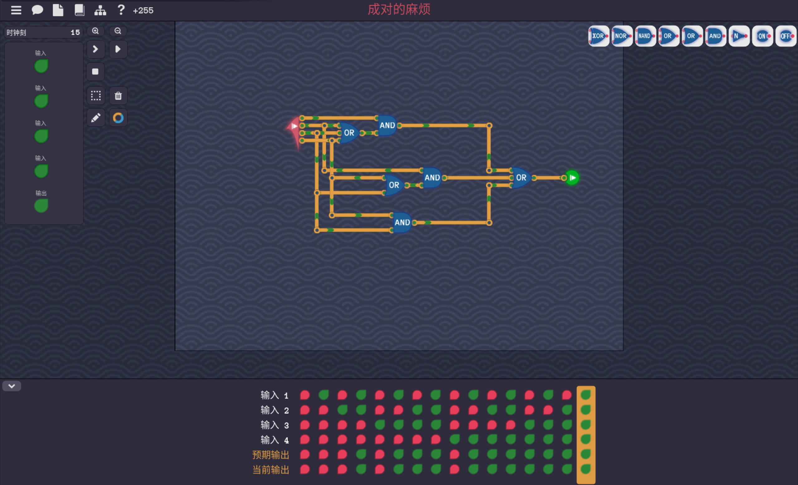

**这道题就不能在观察真值表了，因为输入信号有四个，情况太多了。所以可以用公式化简。[^1]** 

[^1]:前面的关卡都可以用公式化简，好处是通过化简计算一定能够得到结果，但是计算不方便太过于无脑，丧失这个游戏本身的乐趣了

**这里把四个信号定义为ABCD，然后可以将所有的高电平输出的情况罗列出来**

| 输入情况 | 所有可能          |
| -------- | ----------------- |
| 2个1     | AB AC AD BC BD CD |
| 3个1     | ABC ABD ACD BCD   |
| 4个1     | ABCD              |

**AB+AC+AD+BC+BD+CD+ABC+ACD+BCD+ABCD**
**=AB(1+C+CD)+AC(1+D)+AD+BC(1+D)+BD+CD**	
**=AB+AC+AD+BC+BD+CD**
**=A(B+C+D)+B(C+D)+CD**

### 奇数个信号

-----

#### 关卡说明：当输入信号有奇数个为高电平输出为高电平，并且不能使用超过三个元件

#### 提示：两路之间的奇数判断只需要用到1个元件

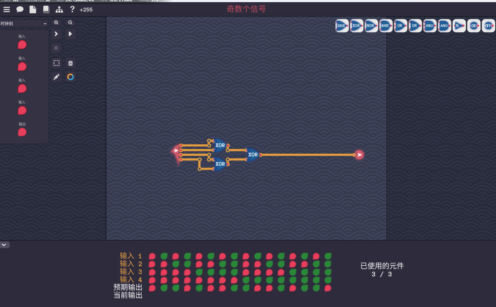

**因为两路之间的奇数判断只用一个元件，所以我们需要找到一个符合奇数输出高电平的元件**

**异或门 同则取零异则取一 也就是说只有一个输入为高电平的时候才输出高电平 符合**

**那这一题就可以看作需要一个四位异或门。**

**由前面的三路与门和三路或门 我们可以大胆猜测这里的四路异或门是由三个异或门组成**

**我们可以验证：当信号为奇数个的时候，只能为1或3。上面为0下面为1或者上面为1下面为2**

**我们可以发现无论哪种情况一定是一路为奇数个高电平 一路为偶数个高电平**

**所以两个异或门的输出一定是不同的电平 那为了确保最后输出是1 就必须放一个异或门 异则取1**

**同理，如果把前面两个异或门换成同或门 仍然可以**

**因为奇数个信号1和3不论那种总是能 一路偶数个高电平 一路奇数个高电平**

**一路相同的信号 一路不同的信号 所以即便执行相反的逻辑 得到的两个输出只是上下调换顺序而已**

**最后再用一个异或门判断就好**

### 循环依赖

----

#### 关卡说明：认识到循环依赖的错误性

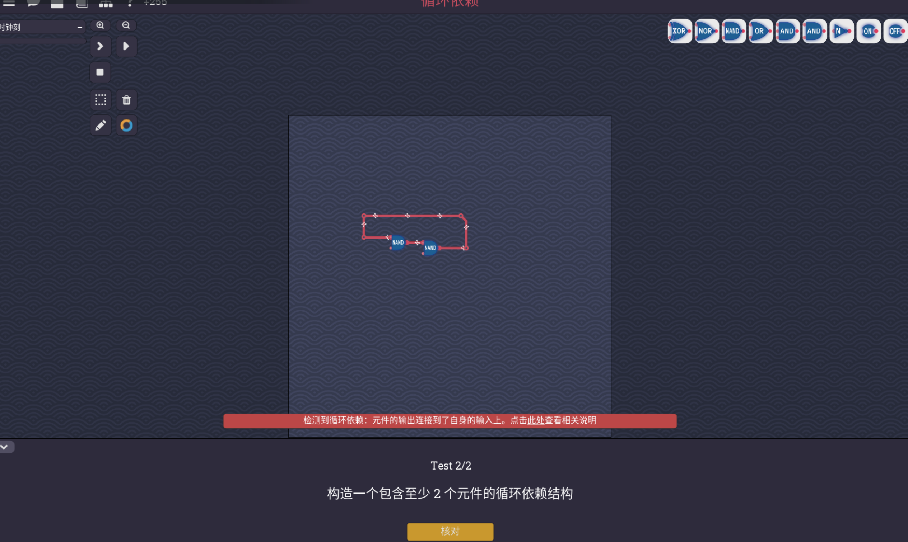

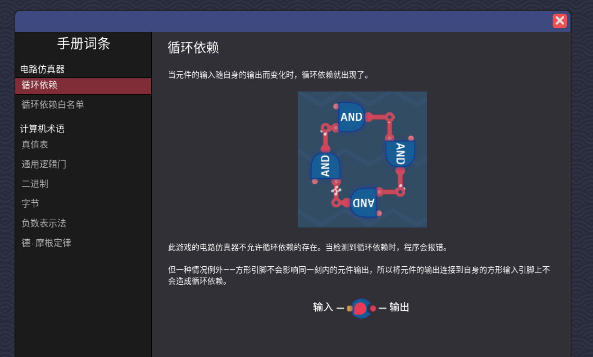

**循环依赖不能使用是因为输出结果受输入结果的影响的同时，输出结果同样影响着输入，无法从输出中判断**

**但是不是所有的循环依赖不允许使用，在锁存器中循环依赖发挥了很大的作用**

### 信号计数

----

#### 关卡说明：这是一个二进制计数器，输出的三个引脚分别代表二进制的1、2、4。通过计数输入信号中高电平的数量，在输出引脚表示

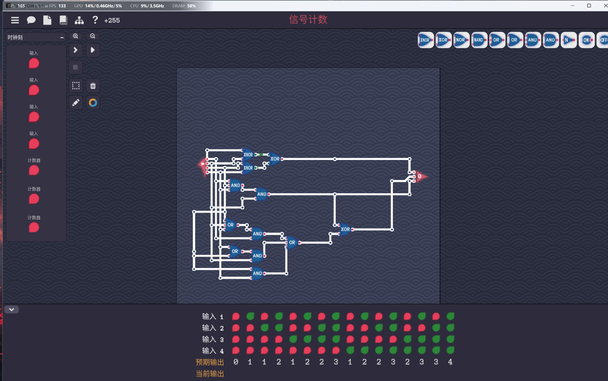

##### 二进制的最低位

观察发现只有当信号中有奇数个高电平时，这一位输出高电平

这个和前面关卡“奇数个信号”的逻辑一样

##### 二进制的第二位

观察发现当信号中有两个以上且不全为高电平时，这一位输出高电平

这个和前面关卡“成对的麻烦”基本相似，只需要在此基础上，保证全为高电平的时候这一位输出低电平就好

| 信号计数             | 0    | 1    | 2    | 3    | 4    |
| -------------------- | ---- | ---- | ---- | ---- | ---- |
| 第二位（成对的麻烦） | 0    | 0    | 1    | 1    | 1    |
| 最高位               | 0    | 0    | 0    | 0    | 1    |
| 第二位（目标输出）   | 0    | 0    | 1    | 1    | 0    |

观察真值表发现，满足异或门的逻辑，在第二位和第三位之间加一个异或门

##### 二进制的最高位

观察发现只有所有信号都是高电平的时候，这一位输出高电平

这个是&与的逻辑，所以就用一个三路与门和一个与门

### 半加器

---

#### 关卡说明：两位的二进制加法，输出结果的两个引脚一个是进位，一个是最低位

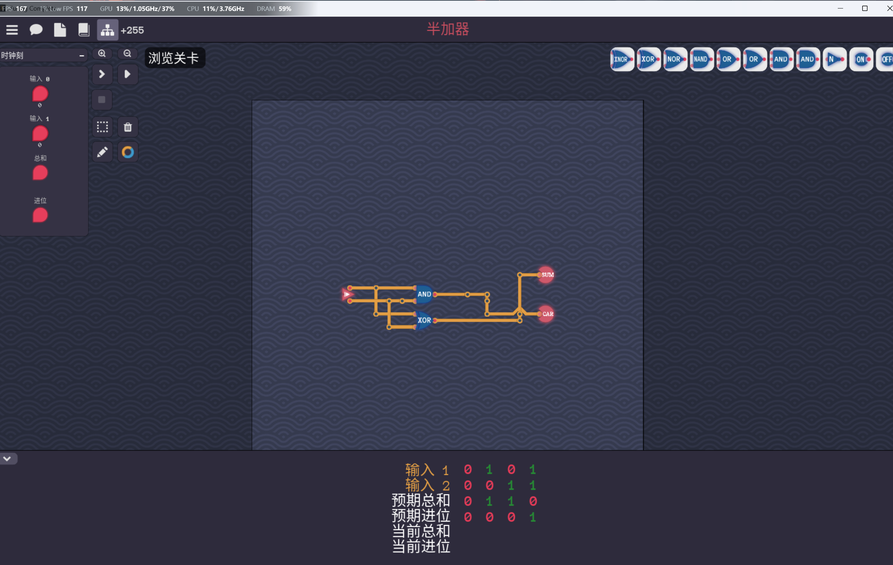

##### SUM

观察真值表，符合异或门的逻辑

##### CAR

逢2进1，只有在输入全是高电平时输出才是高电平，满足与门的逻辑

### 延时线

---

#### 关卡说明：搭建一个延时两刻的电路

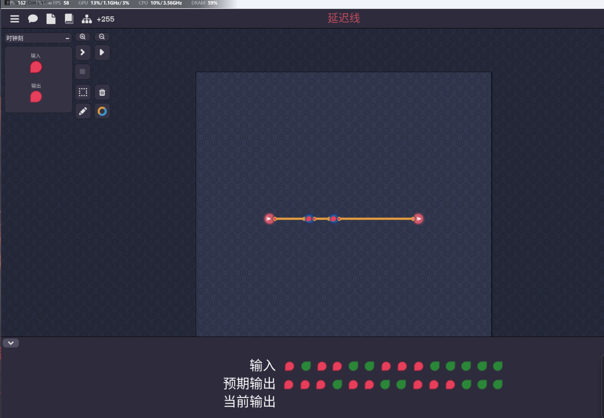

**引入了元件延时线，一个延时线可以延时一刻，所以延时两刻就放两个延时线**

### 加倍

---

#### 关卡说明：本关不在只专注于一位，而是一个字节八位，目标是将输出翻倍

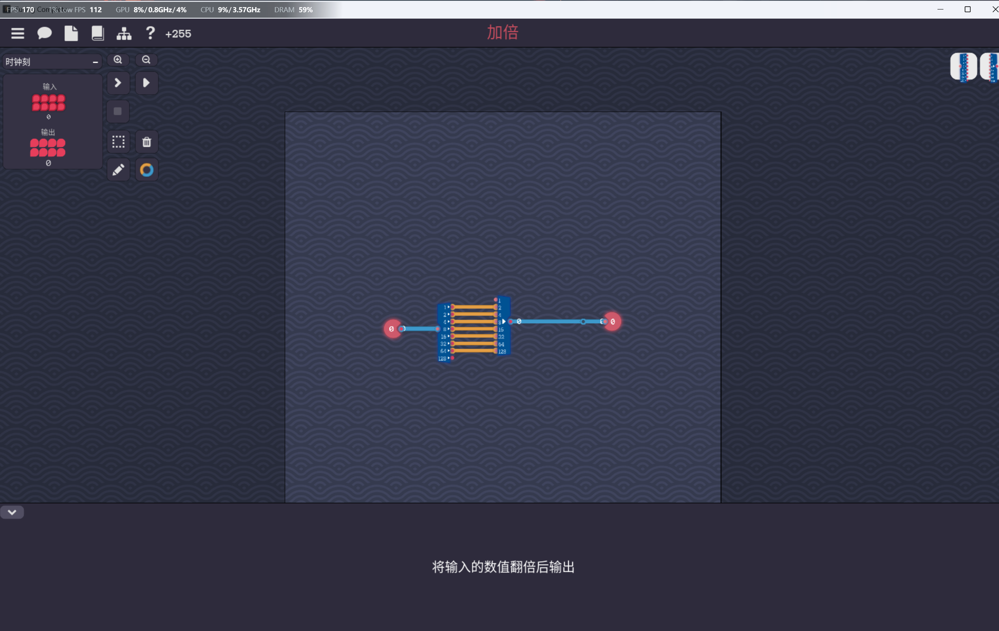

**在计算机里相邻位逢2进1，所以相邻高位是地位的2被，所以只需错位输入就可以得到翻倍的输出**

### 全加器

----

#### 关卡说明：三位二进制加法，进位输出在CAR引脚，低位输出在SUM引脚

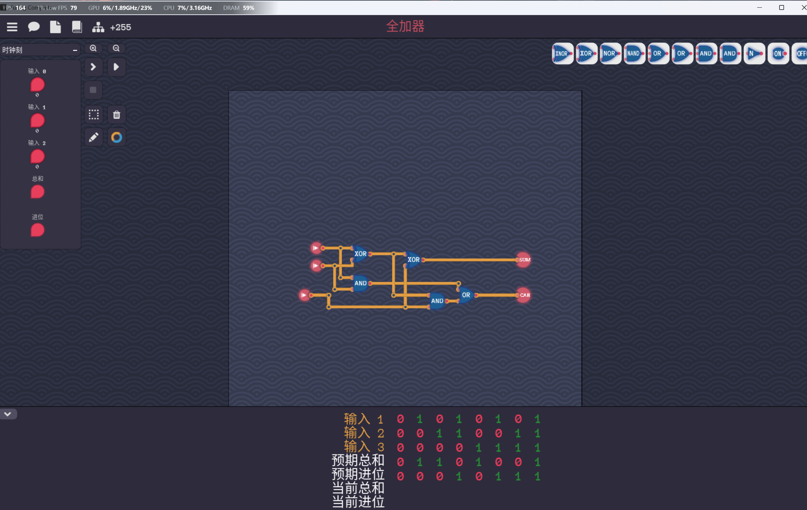

**全加器就是两个半加器的嵌套**

##### SUM

异或门的逻辑，三位异或

##### CAR

半加器是与门的逻辑，全加器就是两个半加器的与门得到的结果相加（+就是逻辑或）

### 奇变偶不变

---

#### 关卡说明:输入不变，输出在奇数时刻输出低电平，偶数时刻输出高电平

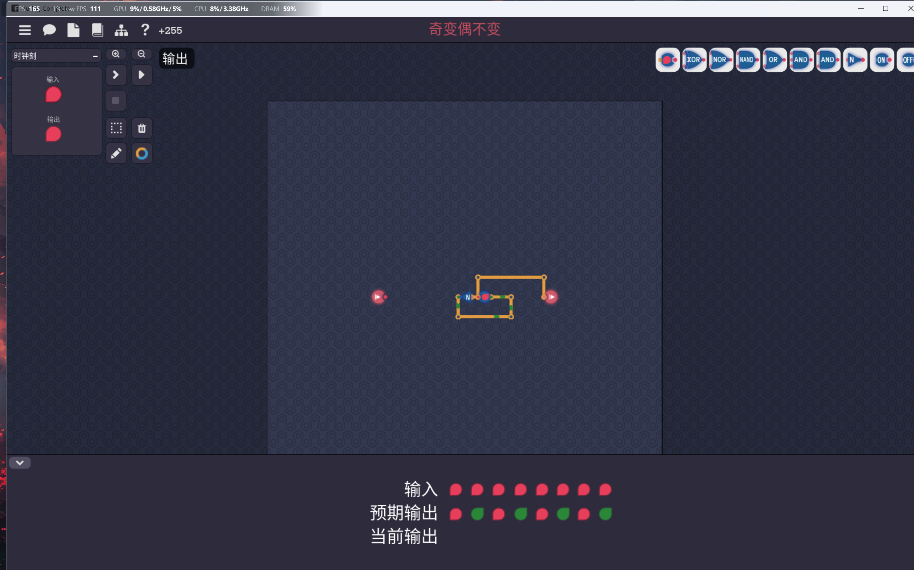

**说是奇变偶不变，其实就是下一时刻取反。**

**因为有了前面解锁的延时输入，我们在延时线后加一个非门，这样就保证了下一刻取反***

### 位开关

---

#### 关卡说明：使用两个非门和两个位开关构建一个或非门

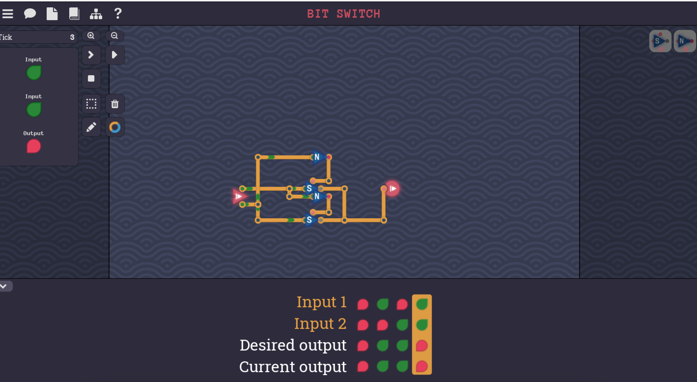

##### 位开关结构

###### 输入端	

这一端连接输入信号

###### 顶端

这一端是控制是否输出当前信号的；

当这一端是低电平时[^2]，输出端为高阻态，不会输出任何信号；

当这一端是高电平时[^3],输出端正常输出输入端的信号。

###### 输出端

这一端输出信号，正常情况下一个输入对应一个输出

但是由于顶端的存在，我们可以同时把两个输出端连接在一起

通过控制顶端让同一时刻只有一个输出

所以要实现异或门就是要：

1. 输入1和输入2都为低电平的时候，都使能
2. 输入1和输入2，一个为低电平一个为高电平的时候，使能输入为高电平的顶端
3. 输入1和输入2都为高电平的时候，都使能

### 位取反器

---

#### 关卡要求：当invert为1时，反转Value的值。当invert为0时，输出value值

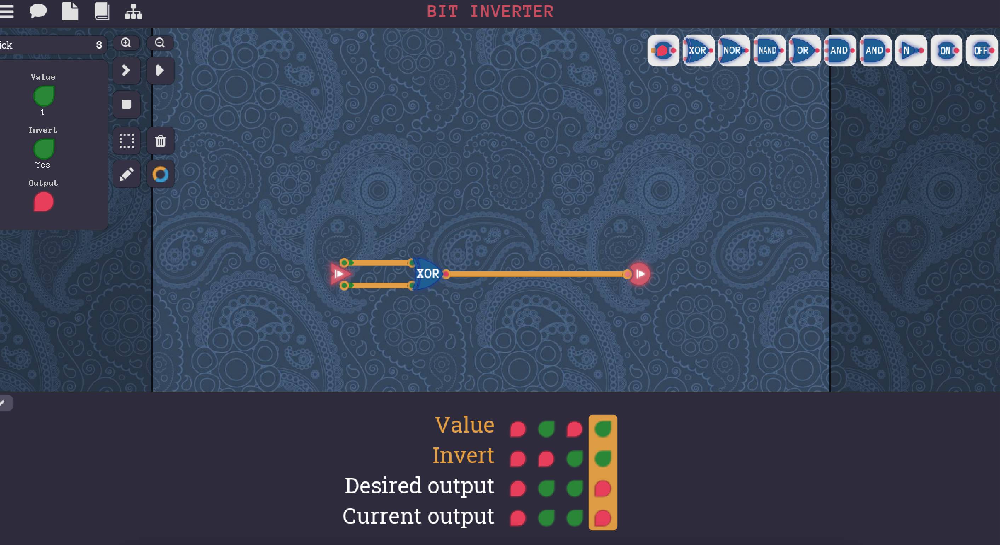

**这里开始引入一种思想**：**两个输入端**，**一端输入值**，**一端控制值的输出**。

这里不需要我们理解很深刻，因为后面做存储器锁存器的时候还会遇到，只需要对这个思想有个基本的了解即可

那么观察输入输出，这个就是==异或门==的逻辑

### 按位或

----

#### 关卡要求：将两个8位二进制数，按位取或，然后输出

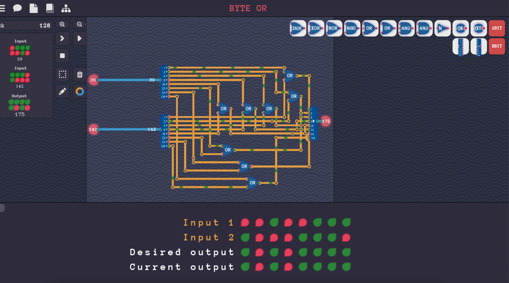

这个就比较简单了，根据字面意思按位或

将两个八位二进制数用分线器把每一位都分出来

然后用8个或门，把每一位两两取或

最后用集线器得到8位二级制数输出

### 按位非

----

#### 关卡说明：8位二级制数按位取反输出

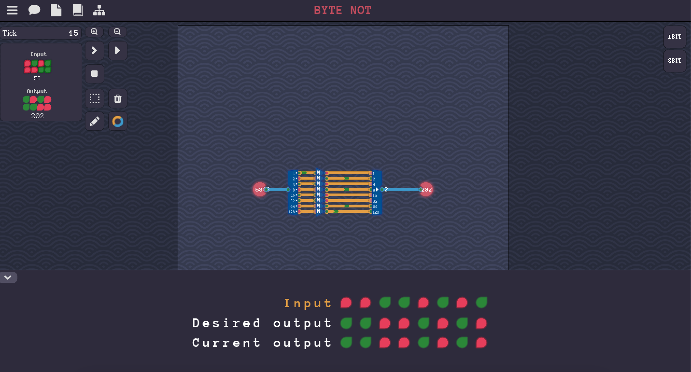

这个也是字面意思，和前面一样

用分线器和非门实现效果，最后用集线器

### 字节加法

----

#### 关卡说明：将两个字节的数据相加

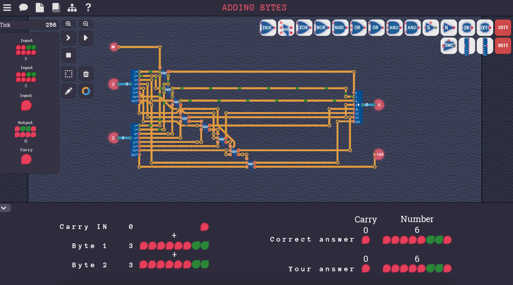

两个输入分别代表两个字节的数

最上面还有一位，这一位代表的是低位的进位；

这一题不仅想模拟的时两个8位的二进制数相加，

如果这两个8位是16位二级制数的高8位相加呢，就要接受来自低八位的进位，

最上面的这一位就是这样的作用，0代表下面没有进位，1代表有进位。

两个输出分别代表相加的结果和第九位[^4]

那明白每个端口的作用之后，这题就非常简单了：

前面的全加器可以实现两位的加法；

那这里的八位加法就用八个全加器就好了；

以第一位为例，三个输入分别是两个数的最低位和最上面的进位；

两个输出分别是本位的总和 以及 下一位的进位；

到了第二位就是，两个数的第二位的输入和来自第一位的进位；

后面以此类推。

### 负数

---

#### 关卡说明：速算速度达到3级

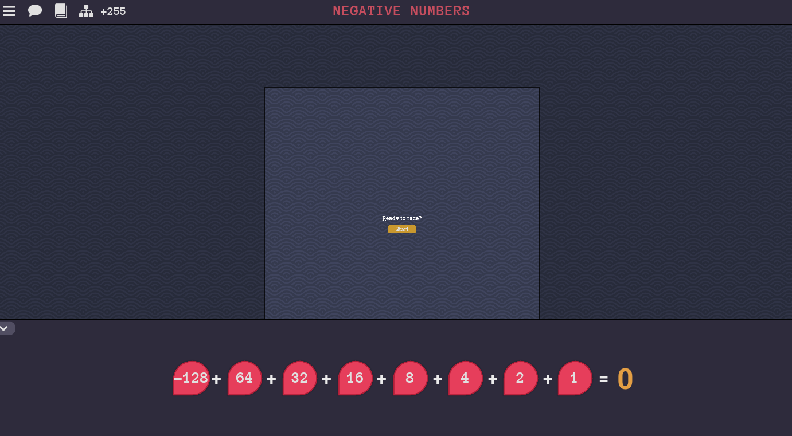

这个就和之前的二进制速算是一样的；

因为后面要引入有符号数，这里是一个铺垫。

### 输入选择器

---

#### 关卡说明：当选择位为0的时候，输出输入1，当选择位为1的时候，输出输入2.

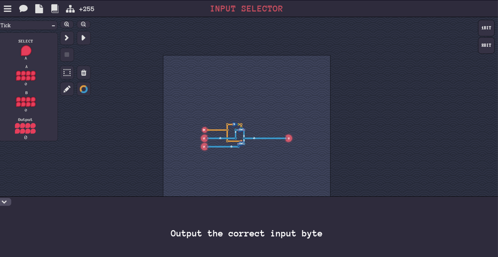

这个让我们想到了==位开关==这一关

位开关就是通过使能位来选择，哪一位输出；

这里不过是把一位的开关换成了八位，逻辑是一样的；

分别将两个输入连接两个八位开关；

将两个八位开关的顶端分别接入使能位；

同时一个加入非门一个不加非门，确保同一时刻只有一个输出。

### 符号数取反器

---

#### 关卡说明：输入一个数，希望得到他的取反数。例如输入5得到-5

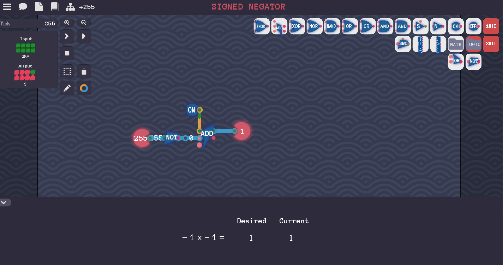

##### 引入概念

###### 原码

最高位为符号位，剩余7位表示大小

符号位为0表示正数，1表示负数

但是会有+0和-0

###### 反码

正数的反码还是本身

负数的反码是在符号位不变的情况下，其他位按位取反

但仍然会有+0和-0

###### 补码

正数的补码还是本身

负数的补码是反码加一

解决了两个0的问题，并且可以把加法变成加法

这题要求相反数，需要按位取反然后加一

[^2]:Disable,代表不使能
[^3]:Enable，代表使能
[^4]:这个第九位可以理解为下面八位相加的之后溢出了

